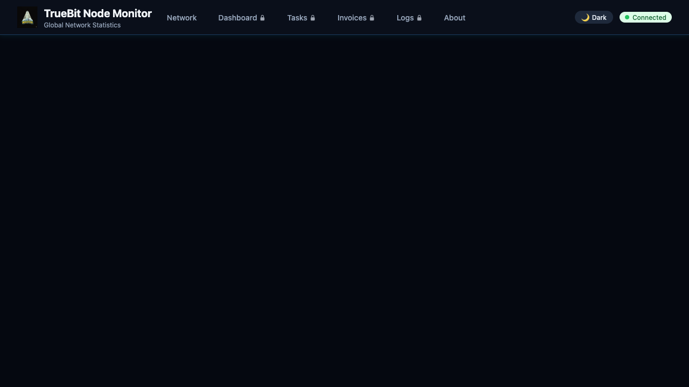

<table>
  <tr>
    <td></td>
    <td>
      <strong>TrueBit Node Monitor</strong><br/>
      <sub>A community-built monitoring dashboard for TrueBit computation nodes</sub>
    </td>
  </tr>
</table>

[](https://www.gnu.org/licenses/gpl-3.0)

## What is this?

The TrueBit Node Monitor gives you visibility into your TrueBit node and the network:

- **Monitor your node**: Track tasks, invoices, and performance metrics
- **See network statistics**: View how many nodes are online and tasks processed across the network

**Note**: Network stats only show nodes with this monitor installed. The more operators who install it, the more complete the picture.

## Installation

### Option 1: Coolify (Recommended)

If you use [Coolify](https://coolify.io/) for deployment:

1. Create a new project in Coolify
2. Add a Docker Compose resource
3. Set the repository: `https://github.com/marcuspuchalla/truebit-node-monitor`
4. Set **Base Directory**: `monitor`
5. Set **Docker Compose File**: `docker-compose.coolify.yml`
6. Deploy

### Option 2: VPS / AWS / Any Server

```bash
# Clone the repository
git clone https://github.com/marcuspuchalla/truebit-node-monitor.git
cd truebit-node-monitor/monitor

# Create the Docker network (connects to your TrueBit node)
docker network create truebit_runner_node_default

# Start the monitor
docker compose up -d

# Get your login password
docker logs truebit-node-monitor 2>&1 | grep -A1 "Password"
```

Open `http://your-server:8090` in your browser.

## Configuration

| Environment Variable | Default | Description |
|---------------------|---------|-------------|
| `CONTAINER_NAME` | `runner-node` | Name of your TrueBit node container |
| `TASK_DATA_PASSWORD` | (auto-generated) | Password for the dashboard |
| `FEDERATION_NATS_URL` | `wss://f.tru.watch` | Federation server URL |
| `LOG_RETENTION_DAYS` | `30` | Days to keep log history |

<p align="center">
  
</p>

## Federation

Your monitor automatically participates in the [tru.watch](https://tru.watch) federation network to enable global network statistics - this is one of the main purposes of this tool: to give the community visibility into how many nodes are online and how many tasks are being processed across the entire network.

If you prefer not to participate, you can opt out in the **Dashboard** (requires login) by clicking **"Leave Network"**. Your preference is saved and persists across restarts.

## Security & Privacy

This monitor is **open source** - you can review the complete source code to verify:

- No private keys are accessed or transmitted
- No data is sent to external servers without your consent
- Only log files are read for monitoring purposes
- Docker socket is mounted read-only

**Recommendations:**
- Only use the official repository - do not run modified versions from untrusted sources
- Review the source code before deploying to production
- Use HTTPS in production environments
- Set strong passwords via environment variables

---

## For Federation Operators

Most users only need the monitor above. If you're running your own federation network:

| Component | Description | Documentation |
|-----------|-------------|---------------|
| Aggregator | Collects data from monitors | [`aggregator/README.md`](aggregator/README.md) |
| NATS | Messaging server | [`nats/README.md`](nats/README.md) |

---

## Important Notices

**USE AT YOUR OWN RISK**: This software is provided "as is" without warranties.

**NOT AFFILIATED WITH TRUEBIT**: This is an independent, community-developed tool.

## Links

- [TrueBit Official](https://truebit.io/) | [TrueBit Docs](https://docs.truebit.io/)
- [Report Issues](https://github.com/marcuspuchalla/truebit-node-monitor/issues) | [Contributing](CONTRIBUTING.md) | [Security](SECURITY.md)

## License

[GNU General Public License v3.0](LICENSE)
